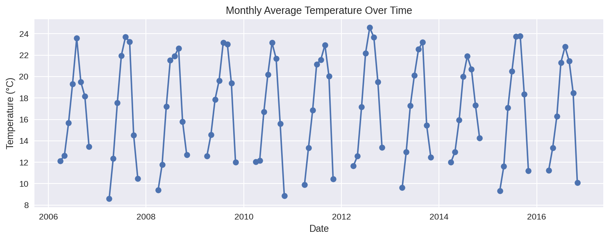
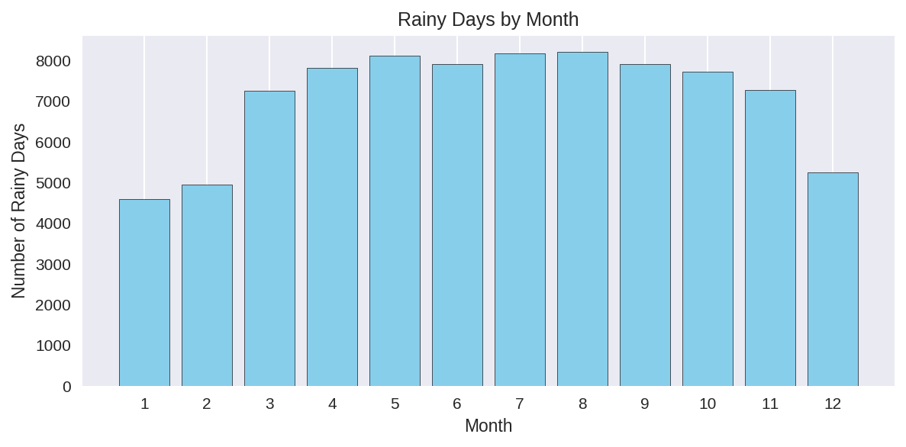
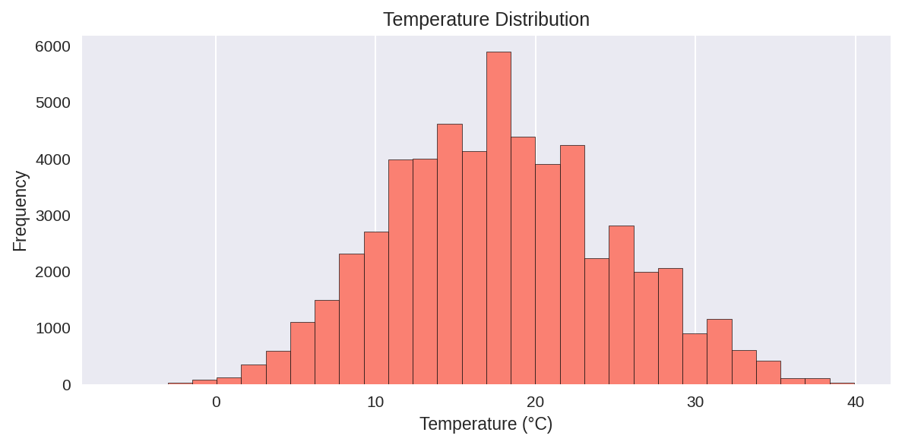

# Weather Data Analysis

**Pandas/NumPy/Matplotlib analysis of 10+ years daily weather data from Kaggle**

Analyzed temperature, humidity, and precipitation patterns. Built complete pipeline: data cleaning → statistical analysis → visualizations.

## 📊 Key Findings

| Metric | Value |
|--------|-------|
| **Dataset Size** | 95,926 daily records |
| **Time Period** | 2006-2016 |
| **Hottest Month** | October (avg 17.6°C) |
| **Coldest Month** | December (avg 10.2°C) |
| **Rainiest Month** | February (most rainy days) |
| **Heatwave Threshold** | 22°C+ (90th percentile) |

## 🔍 Visualizations

**Monthly Temperature Trend**  

**Rainy Days by Month**  

**Temperature Distribution**  

## 🛠️ Tech Stack
## 🚀 Run Locally

## 📈 Skills Demonstrated
- Data wrangling (missing values, datetime conversion)
- Statistical analysis (mean/median/std, percentiles)
- Time-series grouping (monthly/seasonal)
- Professional visualizations (trends, distributions, comparisons)

